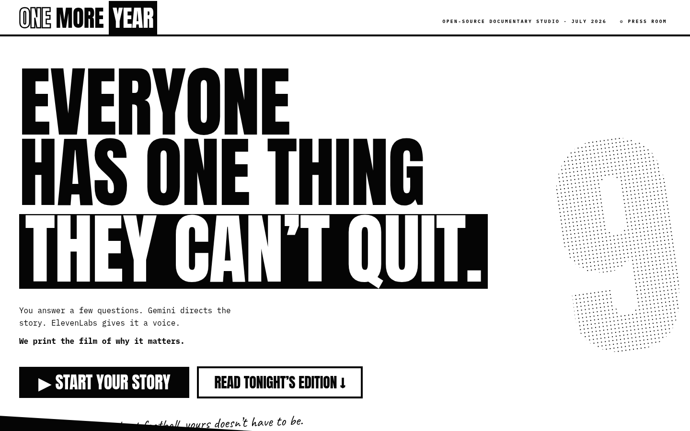
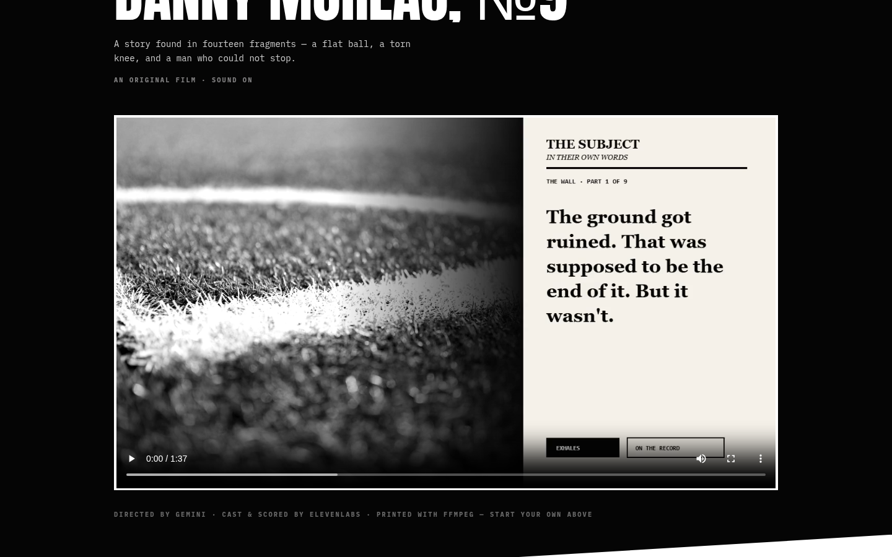

<div align="center">

# ᴏɴᴇ ᴍᴏʀᴇ ʏᴇᴀʀ

**An open-source documentary studio for the thing you cannot quit.**

*Built for the [DEV Weekend Challenge: Passion Edition](https://dev.to) — July 10–13, 2026*

</div>

<br>



<br>

> Everyone has one thing they can't quit.
>
> Most tools would ask you to write it down. This one asks you to say it out loud — then hands it to a director, a cast, a sound desk, and a print desk, and gets you back a real short film.

## What it actually does

You answer four questions. Nothing technical — just *what's the thing you can't quit, when did it almost end, why did you stay,* and *one line only you would say.* That's the entire brief.

From there, a real production pipeline runs — not a template filled in, not a single flat voice reading a script. An AI director reads what you gave it, decides what the story actually is, and hands it to a small cast, a foley desk, and a composer. What comes out the other end is a short documentary: multiple performed voices, sound effects chosen scene by scene, an original score, and real frames — mixed and printed into an mp4, entirely in your browser.

The featured example below, **Danny Moreau, №9**, is a real output of this exact pipeline. Not a mockup, not a storyboard — press play.

<br>



<br>

## The five desks

Every film goes through the same production line a real documentary would — we just compressed the crew into five automated desks.

| Desk | What it does | Powered by |
|---|---|---|
| **01 · The Interview** | Four questions. No writing required. | — |
| **02 · The Director** | Reads your answers, finds the actual arc, writes a full script — casting a narrator, you, and one or two symbolic voices (memory, doubt) pulled from inside the story itself | Gemini, structured JSON output |
| **03 · The Cast** | Every voice is performed, not read aloud — hesitations, corrections, a line that genuinely breaks where it should | ElevenLabs · `eleven_v3` |
| **04 · Sound & Score** | Decides what a scene needs — a stadium, a stairwell, rain — generates that effect, then composes an original, restrained score for the piece | ElevenLabs · Sound Effects + Music v2 |
| **05 · The Print** | Mixes every voice, effect, and cue against the frames and encodes a real mp4 | **ffmpeg.wasm**, running client-side |

Nothing above is simulated. Every desk makes a real API call and the result is inspectable — this is meant to be read, not just demoed.

## The print desk, specifically

This is the part worth pointing at directly: the final assembly — timing every voice line, layering sound effects at the right offsets, ducking music under dialogue, encoding the whole thing into H.264 — happens with **ffmpeg compiled to WebAssembly, running in the tab that's open right now.** There is no render server. Nothing gets uploaded anywhere to become a video; the browser does the actual video engineering, and you get a downloadable file at the end of it.

`lib/assemble.ts` builds the filter graph (concat, amix, adelay, volume ducking) and hands it to `ffmpeg.wasm`; the core binary ships from `public/ffmpeg/` so it works offline once loaded.

## How the director actually directs

The director doesn't summarize your answers — it's told, explicitly, to find the arc: the turn, the doubt, the reason you stayed. It writes two versions of every line: a clean transcript for the interface, and a separate `performance` string written specifically for Eleven v3 — sparse, motivated imperfections only (a repeated word, a false start, a line that catches), so the emotional beats land instead of the whole thing sounding performed.

Every scene also carries a director-chosen **transition** — `direct`, `sound`, or `silence` — so voices sometimes cut straight into each other and sometimes open on rain, a locker room, a stadium roar. The opening always earns its place with a real generated sound bed before anyone speaks. And every film gets a score: the director can choose instrumental, vocal, or hybrid, but never silence — a story built around restraint still gets a sparse, deliberate score rather than nothing at all.

## Try it yourself

The Studio — the "Start your story" flow — runs for real the moment you connect a key:

- **⚙ The Press Room** stores your **Gemini** key locally in your browser. Get one free at [aistudio.google.com](https://aistudio.google.com).
- The **ElevenLabs** key is server-side only, in `ELEVENLABS_API_KEY` — it never touches browser JavaScript. Before every run the app checks your subscription tier and remaining credits, and caches successful TTS/SFX/music responses by content hash in IndexedDB, so re-mixing or refreshing never re-purchases identical audio.

```bash
npm install
npm run dev
```

Open **http://localhost:3000**, click **⚙ press room**, drop in your keys, and press **▶ Start your story**. Headphones recommended.

```bash
# .env — server-side only, never sent to the browser
ELEVENLABS_API_KEY=your_key_here
```

## The house cast

Voices are drawn from a small, project-curated allowlist in `lib/voices.ts` — not the full ElevenLabs library, and not voice cloning. The allowlist is enforced immediately before every TTS request, so nothing outside it can be selected even by editing local storage directly.

## Open-source by design

Nothing here is a black box. The interview, the director's prompt, cast assignment, every Gemini and ElevenLabs call, the procedural fallback art, and the browser-side print desk all live in this repository — inspect any of it in `lib/`. Bring-your-own-key mode means the whole prototype runs without anyone operating a paid proxy on your behalf.

## Stack

Next.js (App Router) · TypeScript · Tailwind CSS v4 · **ffmpeg.wasm** · Gemini API · ElevenLabs API · Anton + IBM Plex Mono + Caveat

## Built for two prize categories

This submission integrates both **Google AI** (Gemini directs every story: structured JSON output, image generation, the entire creative arc) and **ElevenLabs** (every voice, every sound effect, and every score is generated live through `eleven_v3`, Sound Effects, and Music v2) — genuinely, not as a checkbox integration.

## Challenge notes

All code in this repository was started and completed within the [DEV Weekend Challenge](https://dev.to) window (July 10–13, 2026).

<br>

<div align="center">

*Directed by Gemini. Performed by ElevenLabs. Printed by you.*

</div>
